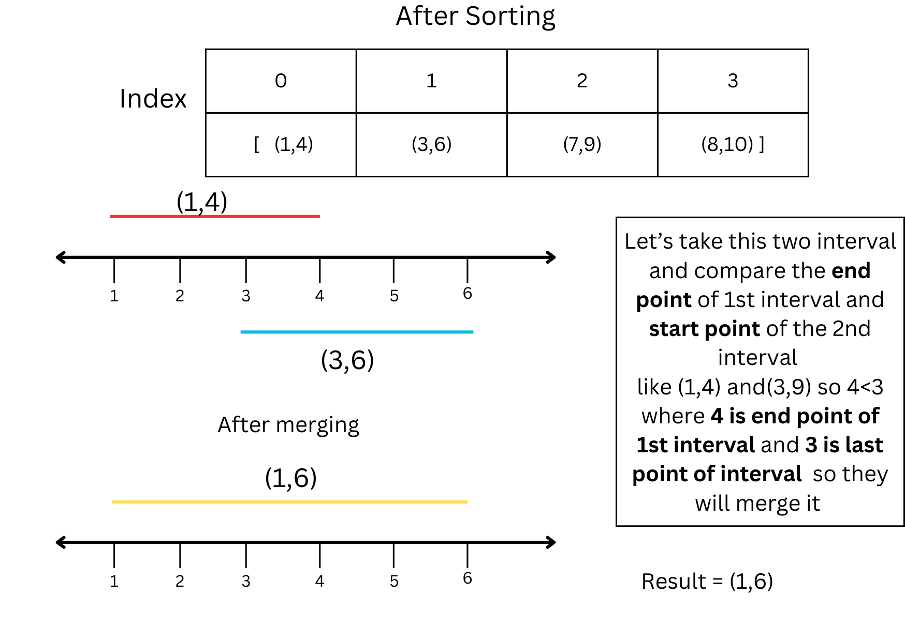
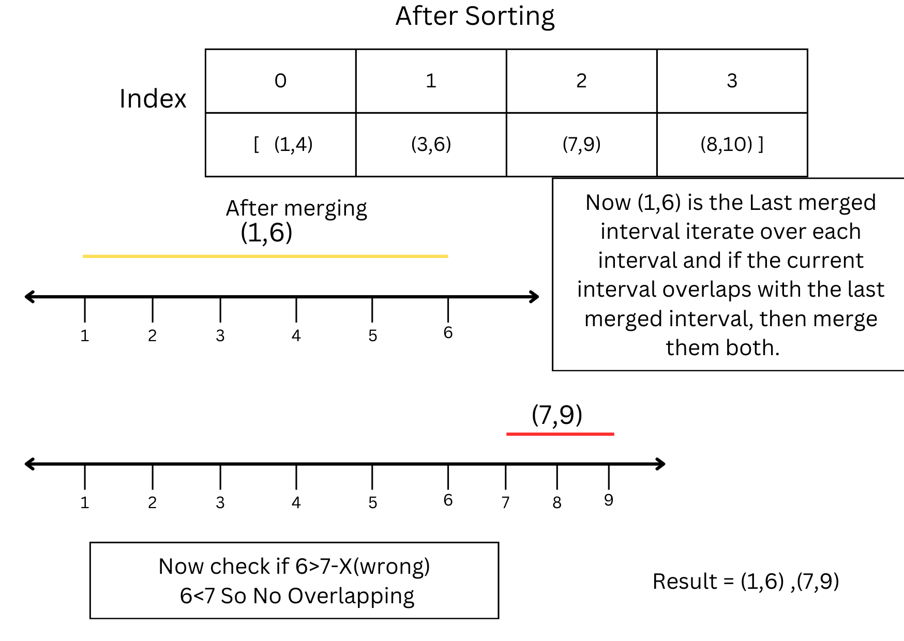

<h1> Merge Intervals :</h1>
Given an array of time intervals where <b>arr[i] = [start<sub>i</sub>, end<sub>i</sub>].</b>
<h1>Task :</h1>
Merge all the <B>overlapping intervals</B> into one and The result which should have only <b>Mutually Exclusive intervals</b>.
<h1> Example :</h1>


<h2> Steps to solve : </h2>
<ul>
  <ul>
    <li>First, Sort the intervals based on their starting points.</li>
       
   
     <li><b>Disclaimer:</b></li>
     <li>If Intervals' starting positions have the same value, then sorting will be based on their ending points.</li>   
        
  </ul>
  <ul>
   <li>After Sorting , It will be easy to Merge intervals by comparing the end point of first interval and Start point of Second Interval </b>.</li>
   
    <li>  This allows us to easily identify overlapping intervals by comparing each interval with the last merged interval </li>
    <li> Now, Iterate over each interval and if the current interval overlaps with the last merged interval, then merge them both.</li>
    
    <li> Append the merged interval to the result.</li>
    
  </ul>
Refernce Link : https://www.geeksforgeeks.org/merging-intervals/#expected-approach-checking-overlapping-intervals-only-onlogn-time-and-o1-space
</ul>
 <h1> Code :</h1>
 
``` cpp
vector<vector<int>> mergeOverlap(vector<vector<int>>& arr) {

    // Sort intervals based on start values
    sort(arr.begin(), arr.end());
  
    vector<vector<int>> res;
    res.push_back(arr[0]);

    for (int i = 1; i < arr.size(); i++) {
        vector<int>& last = res.back();
        vector<int>& curr = arr[i];

        // If current interval overlaps with the last merged
        // interval, merge them 
        if (curr[0] <= last[1]) 
            last[1] = max(last[1], curr[1]);
        else 
            res.push_back(curr);
    }

    return res;
}
 
````
  

       
