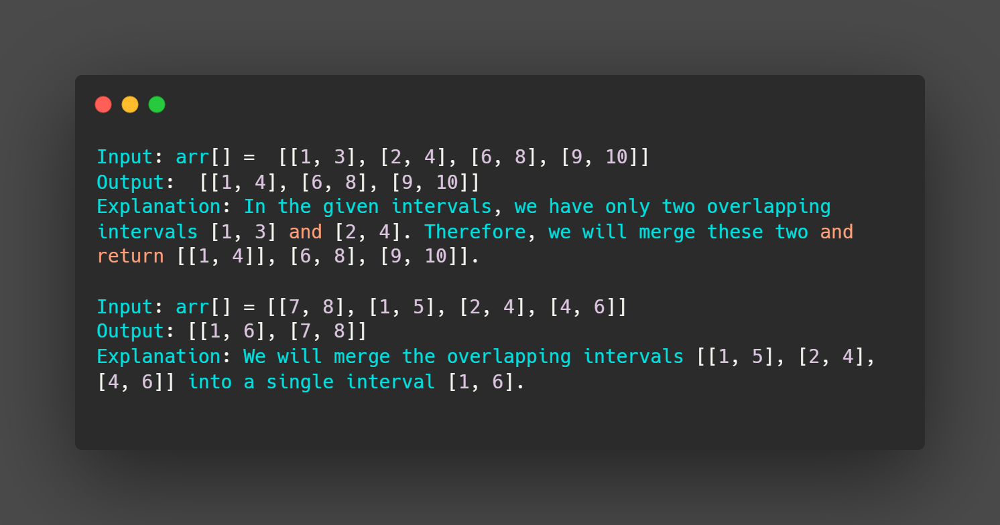

<h1> Merge Intervals :</h1>
Given an array of time intervals where <b>arr[i] = [starti, endi].</b>
<h1>Task :</h1>
Merge all the <B>overlapping intervals</B> into one and The result which should have only <b>Mutually Exclusive intervals</b>.
<h1> Example :</h1>

<h2> Steps to solve : </h2>
<ul>
  <ul>
    <li>First, Sort the intervals based on their starting points.</li>
       
   
     <li><b>Disclaimer:</b></li>
     <li>If Intervals' starting positions have the same value, then sorting will be based on their ending points.</li>   
             
  </ul>
  <ul>
   <li>This allows us to easily identify overlapping intervals by comparing each interval with the <b> last merged interval</b>.</li>
   
  </ul>

</ul>
  

       
