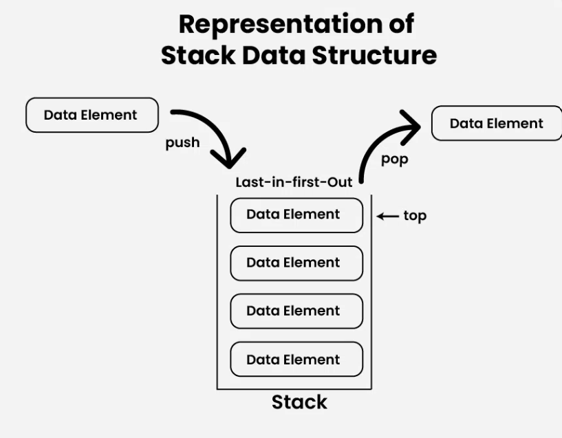

<h1>Stack</h1>
    

        Stack is a linear data structure that follows the <strong>LIFO</strong> (Last In First Out) principle. 
        The last element inserted is the first to be popped out. This means both insertion and deletion 
        operations happen at one end only.
    

    
 <h1>Basic Operations on Stack</h1>
    

        In order to manipulate elements in a stack, there are certain operations provided to us:
    

<h1>Basic Operations on Stack</h1>
    

        In order to manipulate elements in a stack, there are certain operations provided to us:
    

    <ul>
        <li><strong>push()</strong>: Inserts an element into the stack.</li>
        
        
<li><strong>pop()</strong>: Removes the top element from the stack.</li>
        
      <li><strong>top()</strong>: Returns the top element of the stack without removing it.</li>
      
        
<li><strong>isEmpty()</strong>: Returns <code>true</code> if the stack is empty; otherwise, returns <code>false</code>.</li>
        
        
  <li><strong>isFull()</strong>: Returns <code>true</code> if the stack is full; otherwise, returns <code>false</code>.</li>
        
    </ul>

<h2>Example Usage:</h2>
    <pre>
        Stack stack;
        stack.push(10);    // Inserts 10 into the stack
        stack.push(20);    // Inserts 20 into the stack
        stack.pop();       // Removes 20 from the stack
        stack.top();       // Returns 10 (top element)
        stack.isEmpty();   // Returns false (stack is not empty)
        stack.isFull();    // Returns true (if stack size limit is reached)
    </pre>
