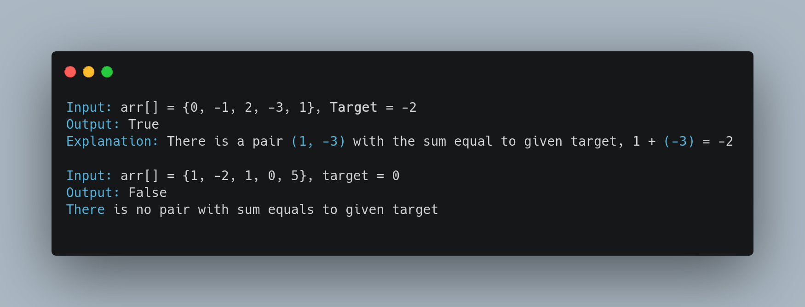

<h1> Two Sum </h1>

  You will be Given an array <b>arr[] of n integers </b> and a <b>target value</b>

  <h3>Task :</h3> Find whether there is a <b>pair of elements in the array whose sum is equal to target.</b>

